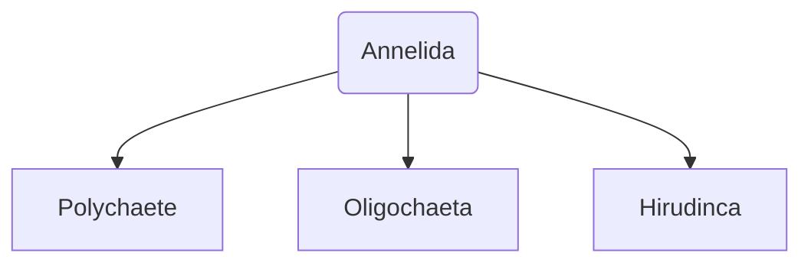

# Annelida (тип Кольчатые черви)
## класс Многощетинковые (Polychaete)
## класс Малощетинковые (Oligochaeta)
## класс Пиявки (Hirudinca)
## 

```mermaid
graph TB;

A(Annelida)-->Polychaete
A-->Oligochaeta
A-->Hirudinca
```

Метамирия - 