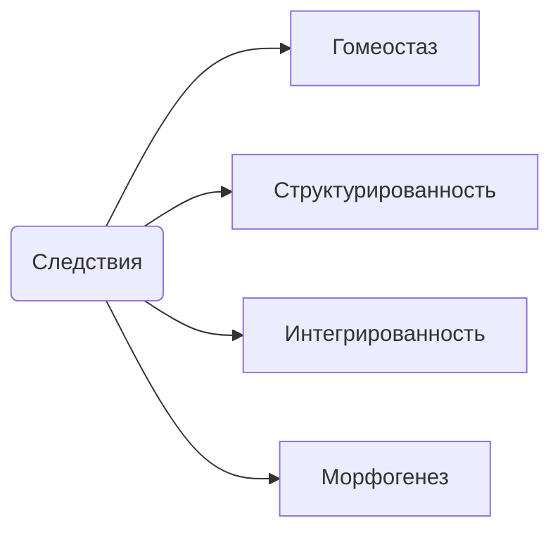
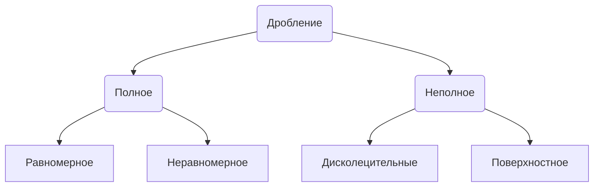

---

---
# Eumetazoa
*истинные животные*

## Особенности
- Опоясвывающие контакты
- Эпителии

## Следствия появления эпителия

## Морфогенез
- Гомолецитальные - желток равномерно распределен по цитоплазме
- Телолецитальные - желток компактен и полярен
- Центролецитальные - желток сосредоточен компактно в центре яйца
Распределение желтка влияет на дробление
![[IMG_20231030_092547541.jpg]]
### Дробление

### Гаструляция
![[IMG_20231030_094202759.jpg]]
## Образование мезодермы
- Путём инвагинации первичной кишки
- Путём миграции клеток первичной кишки

## Цитотипический этап
Если мы разрежем Морулу или Бластулу - мы получим два организма

## Органотипический
при разделении организм погибает или погибает в будущем

![[IMG_20231030_101330579.jpg]]