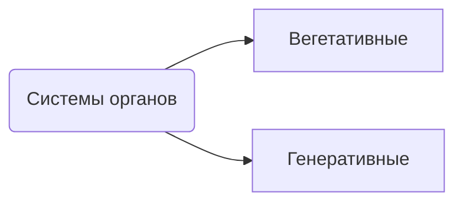
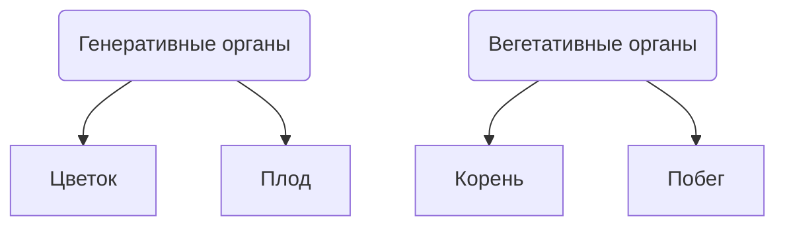
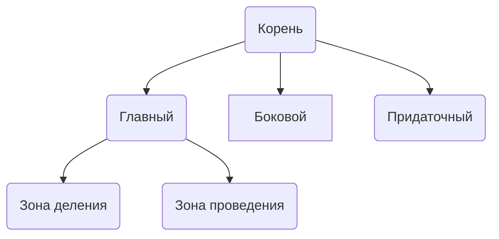
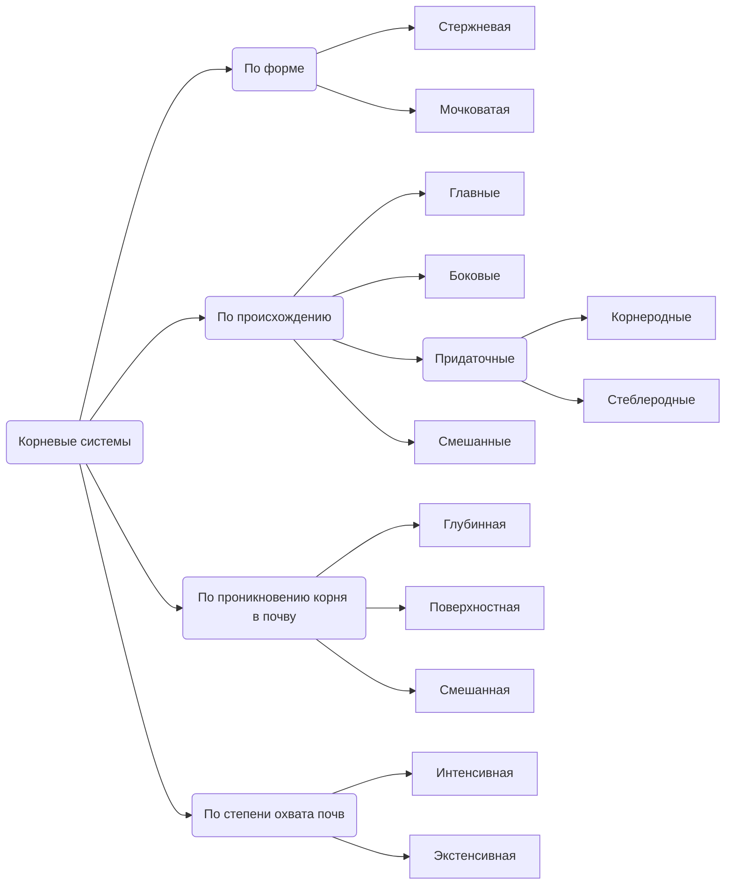

---

---
# Анатомия и морфология растений
Гёте Иоганн - описал метаморфоз растений

## Корень и корневые системы

### Функции корня
* Опорная
* Запасающая
* Всасывающая
* Вегетативное размножение - при помощи придаточных почек
* Синтез органических веществ
* *Аллелопатия* - влияния совместно произрастающих растений друг на друга, обеспечивающее их взаимодействие

### Особенности
- Цилиндрическая форма и радиальная симметрия
- Верхушка - конус
- Верхушечный рост и боковое ветвление
- На меристематическом кончике корня находится корневой чехлик, имеющий защитную функцию
- Боковые корни закладываются эндогенно
- Корни могут образовываться на стебле и в листьях
- **На корнях никогда не формируются листья и генеративные органы! Но могут образовываться почки** 
- Образуется из зародышевого корешка семени

dasd

### Типы корней

### Корневые системы
КС - совокупность всех корней растения

Стержневая - есть один мощный корень, а остальные менее развитые
Мочковатая - множество корней, образующих мочку

### Специализация и метаморфоз корней
**Метаморфоз** - резкая смена или расширение функции, которая ведёт к видоизменению органов или его внутреннего строения. Это изменение наследственно закреплено

#### Корневые шишки
Сильно утолщенные придаточные корни, запасающая функция
#### Столбовидные корни
![[Pasted image 20230915115907.png]]
#### Ходульные корни
#### Корни-зацепки
#### Дыхательные корни
#### Воздушные корни
#### Корни-присоски
#### Бактериальные клубеньки
#### Микориза (**НЕ метаморфоз**)
Не метаморфоз, т.к. генетически не закреплено