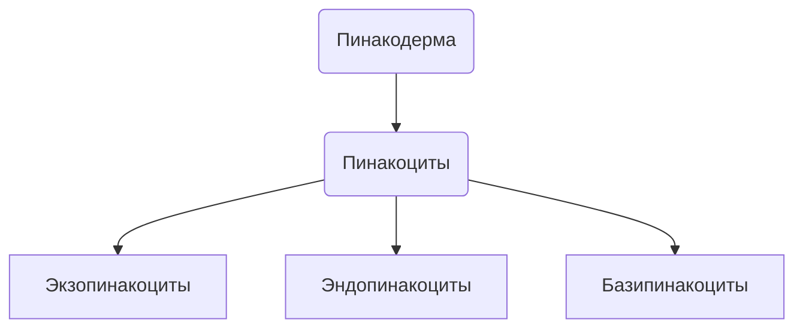
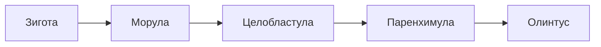

# Губки Porifera (Spongia)
![[photo_2023-10-25_17-15-15.jpg]]


## Жизненный цикл
1 Вариант эмбриогенеза

2 Вариант
```mermaid

```

## Классификации
```mermaid
graph TD;

	P(Porifera) --> S(Symplasma)
	P --> C(Cellularia)
		S --> Hexactinellida
		C --> Calcispongia
		C --> Demospongia
		C --> Homoscienomorpha
```
У Symplasma почти вся хоанодерма превращается в синцитий
Hexactinellida 
Calcispongia - скелет из $CaCO_3$
Demaspongia - SiO2 + спонгии

## 