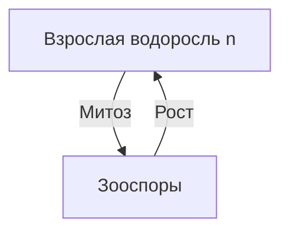

# Жизненный цикл растений
## Основные наборы хромосом у растений:
1. Гаметы - n
2. Споры - n
3. Эндосперм [[Голосеменные|голосеменных]] - n
4. Эндосперм [[Покрытосеменные|покрытосеменных]] - 3n
5. Гаметофит - n
6. Спорофит - 2n
7. Зигота и зародыш - 2n
8. -спорангии - 2n
## [[Base/Митоз и мейоз#Жизненный цикл растений|Митоз и мейоз]]
## Водоросли
### Хламидомонада

### Улотрикс
#### Бесполое размножение (неблагоприятные условия)

#### Половое размножение (благоприятные условия)
Взрослая водоросль (n) $\xrightarrow{\text{Митоз}}$ Гаметы (n)$\xrightarrow[\text{n+n}]{\text{Ополодотворение}}$Зигота (2n)$\xrightarrow{\text{Мейоз}}$Cпоры (n)$\xrightarrow{\text{Рост}}$Взрослое растение (n) 
### Ламинария
У ламинарии, в отличие от других водорослей преобладает спорофит
![[../Sources/жизнцикллам.jpg]]

## отдел Моховидные
- Преобладает Гаметофит

Листостебельное растение (n) $\xrightarrow{\text{Митоз}}$ Гаметы (n)$\xrightarrow[\text{n+n}]{\text{Ополодотворение}}$Зигота (2n)$\xrightarrow{\text{Рост}}$Коробочка со спорами (спорофит) (2n)$\xrightarrow{\text{Мейоз}}$Споры (n)$\xrightarrow{\text{Рост}}$Протонема (n)$\xrightarrow{\text{Рост}}$Взрослое растение (n) 
![[../Sources/жизнциклмхов.jpg]]
## отдел Папоротниковидные
- Доминирует Спорофит
![[../Sources/жизнциклпап.jpg]]
## Семенные
- Появляется семя
- Гаметофит РЕДУЦИРОВАН
- Преобладает спорофит (2n)

## Голосеменные
![[../Sources/жизнциклголсем.jpg]]
## Покрытосеменные 
![[../Sources/жизнциклпокрытсем.jpg]]

## Выводы:
- Спорофит доминирует у всех семенных и папоротников, у ламинарии
- Гаметофит доминирует только у водорослей и мхов
# References:
-  [Жизненные циклы растений](https://www.youtube.com/watch?v=LoyT5Fc8mvU)