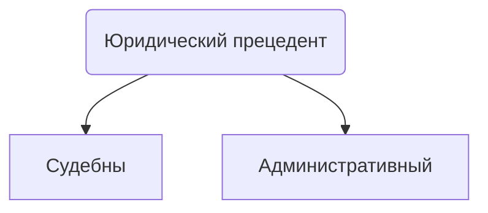

# Источники прав
## Определение (позитивизм)
**Источник права (форма права)** - способ закрепления нормы права
## Виды источников права
1. Согласно позитивизму - $Право=закон=приказ{ }государства$
Если право создаётся государством, то главный способ закрепления нормы права - закон
2. 

3. Правовой обычай
4. Договор