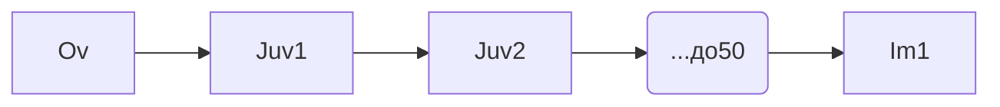

# Метаморфоз насекомых

## Типы развития
***
**Ov** - *яйцо*
**Juv** - *ювениальный период*
**Na** - *наяда*
**SubIm** - *субимаго*
**Ny** - *нимфа*
**L** - *линька*
**Pp** - *prepupa - предкуколка*
***
**Аметаболия.** Характерна для скрытночелюстных насекомых 

**Гемиметаболия** (стрекозы, веснянки...)

Наяды довольно мало похожи на имаго, у них развиты только зачатки крыльев и всегда присутствует провизорные органы
![[Провизорные органы#Определение]]
Все наяды живут в воде

**Архиметаболия**

Менее хитинизированные покровы и живые крылья (непогибшие клетки)

**Паурометаболия** (полужесткокрылые (клопы, тараканы))

Отличия нимф от наяд
Похожи на наяд,но всегда развиты только зачатки крыльев

**Голометаболия** - развитие с полным превращением (перепончатокрылые, жесткокрылые, двукрылые)

## Типы личинок
По наличию или отсутствию конечностей:
- **Олигоподные** Хорошо развитые конечности на грудных сегментах
- **Полиподные** Кроме грудных конечностей, развиты брюшные ложные ноги
- **Аподные** Нет ног
- **Протоподные** Развиты только зачатки грудных ног

По их внешнему виду в целом:
- **Камподеовидные** Личинки с сильно склеритизованным телом, хорошо развитыми конечностями. На предпоследнем брюшном сегменте развиты церки и для них характерна *прогнатическая* голова ![[Церки]]
- **Эруковидные** - личинки со слабосклеротизированными покровами, конечности развиты или отсутствуют, тело С-образно загнуто
- **Проволочниковые** - с цилиндрическим телом, сильно склеротизованными покровами и конечности как правило короткие, часто первое пара выполняет копательную функцию
- **Червеобразные** - слабосклеротизованные или без конечностей или с редуцированными ногами

## Типы куколок
- **Открытая** - зачатки крыльев, ротового аппарата или конечностей не слиты с телом
- **Покрытые** - зачатки плотно сцеплены с телом
- **Скрытая куколка (пупарий)** 