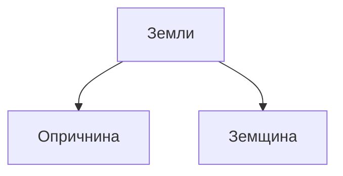
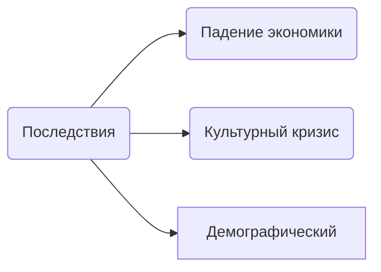

---

---
# Опричнина
## Main
Второй период правления Ивана IV
1565-1572
### Конец 1564
Александр уехал в слободу, никого при это не прдубредив. Месяц столица жила без царя.
К нему поехали послы и стали умолять, чтобы он вернулся в Москву
Он этого и ждал, и отправил с гонцами две грамоты:
1. Предназначалась боярам
2. Простому народу
На простой было написано что на них его царский гнев не распространяется
Боярам было написано, что он обвиняет их во всех смертных грехах, в частности в измене царю 
Когда вернулся в Москву - он учередил опричнину
**Опричнина** - все земли российского государства были подведены на две части:

В опричнину вошли самые плодородные черноземные земли
В земщину все остальные

Было создано войско опричников (1000 чел)
Опричников все боялись и во время опричнины был голод в России 

Известный опричник - *Малюта Скуратов*

Иван IV стал задумывься об отмене опричнины (1572)

### Последствия 

* Падение экономики
* Культурный кризис
* Демографический

### Последние годы жизни
Убийство его сына

