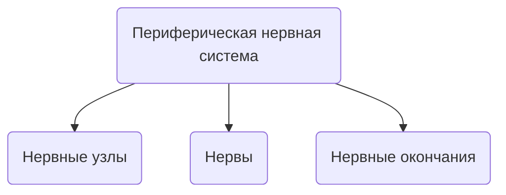
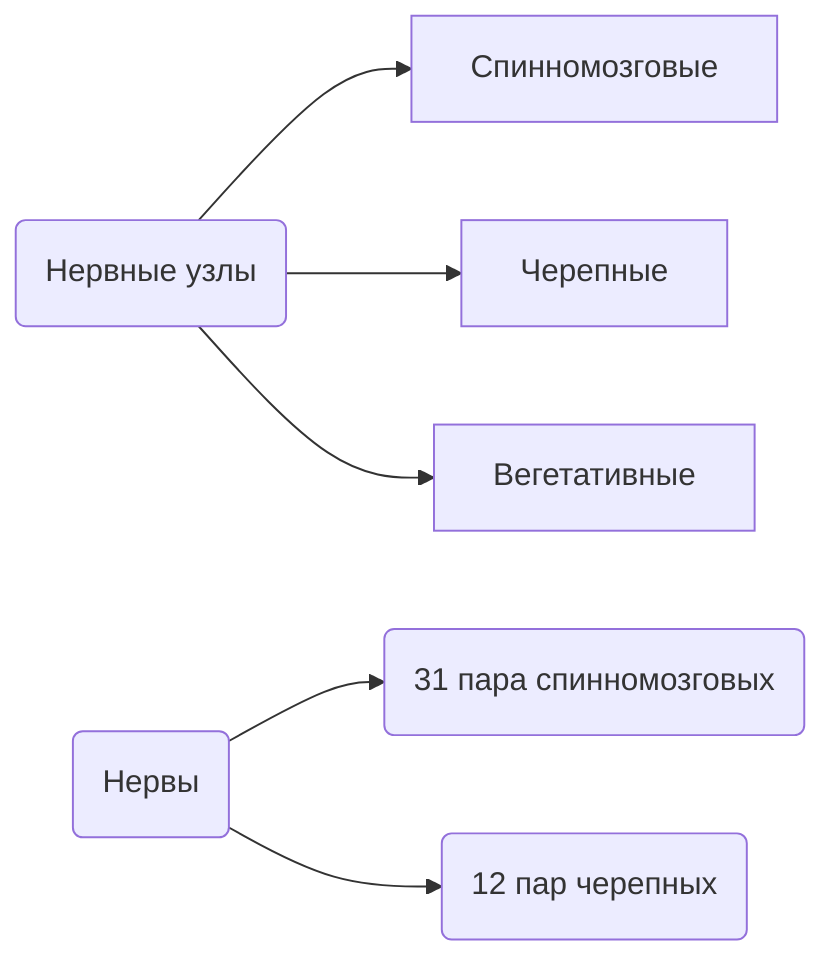

```mermaid
graph TD;
ПНС(Периферическая нервная система) --> НУ(Нервные узлы)
ПНС --> Н(Нервы)
ПНС --> НО(Нервные окончания)

```

```mermaid
graph LR;
НУ(Нервные узлы) --> Спинномозговые
НУ --> Черепные
НУ --> Вегетативные

Н(Нервы) --> см(31 пара спинномозговых)
Н --> ч(12 пар черепных)

```

# References:
- [[G_Bilich_V_Kryzhanovsky_Biologia.pdf#page=342]]