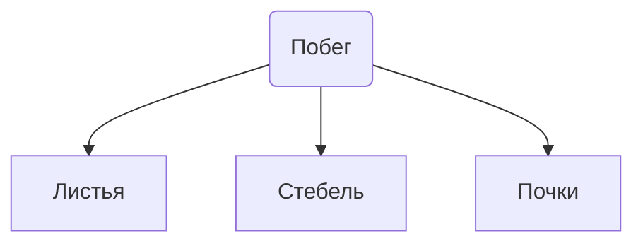
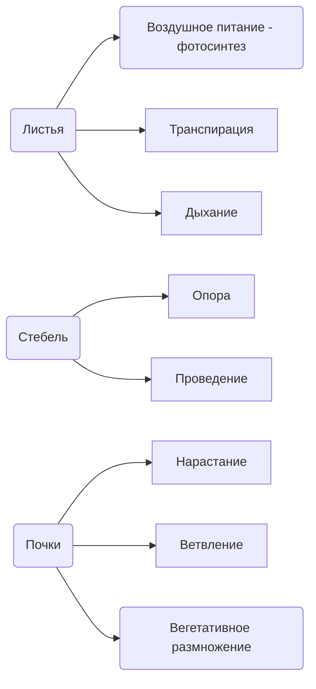

---

---
# Побег и побеговые системы

## Определение
**Побег** - стебель с расположенными на нем листьями и почками
**Пазуха** - угол между листом и вышерасположенным междоузлием
**Пазушная и верхушечная почка** - почка в пазухе и сверху стебля соответсвенно

## Строение
Для растения характерна метамерная организация

![[Побег и побеговые системы 2023-10-05 12.54.excalidraw.png]]
%%[[Побег и побеговые системы 2023-10-05 12.54.excalidraw.md|🖋 Edit in Excalidraw]], and the [[Побег и побеговые системы 2023-10-05 12.54.excalidraw.dark.png|dark exported image]]%%
**Метамер** - участок побега, который включает в себя узел и нижележащие междоузлие

## Функции

**Ствол** - одревесневший многолетний стебель
![[Побег и побеговые системы 2023-10-05 13.19.excalidraw]]
[[Почки]]
### Годичный и элементарный побег
**Годичный побег** - побег, рост и формирование которого во внепочечный период жизни заканчивается в течение одного года
**Элементарный побег** - побег, который формируется за один период роста

## Морфологические типы побегов

По длине междоузлий
1. Удлиненный - узлы находятся далеко друг от друга
2. Укороченный (у травянистых розеточные)
