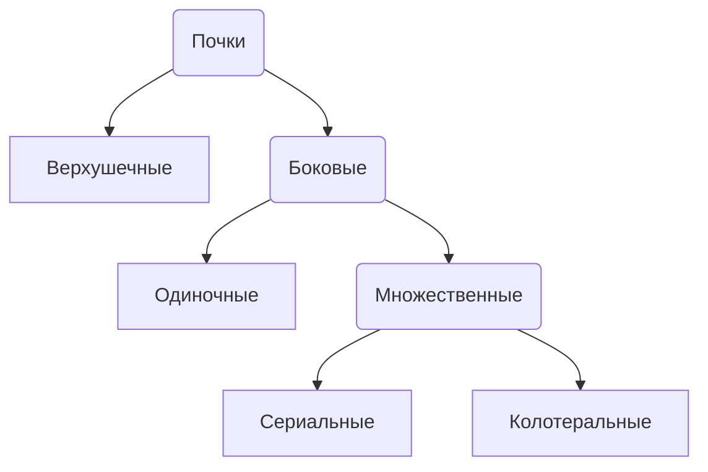
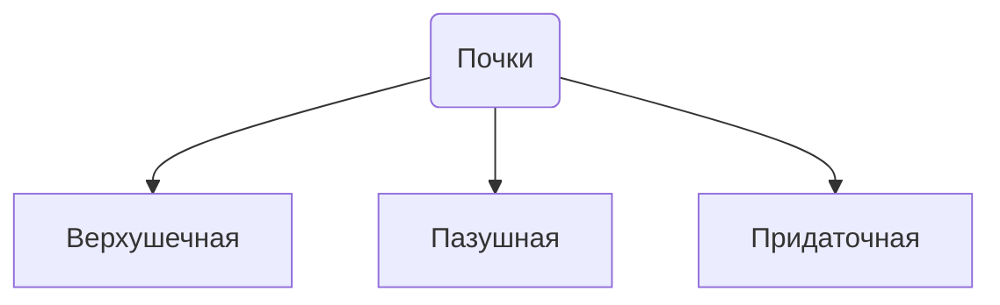
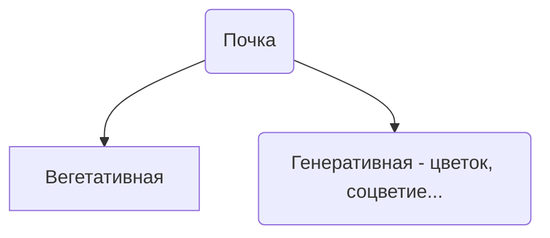
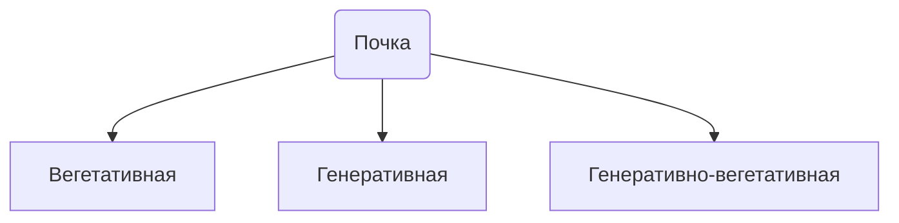
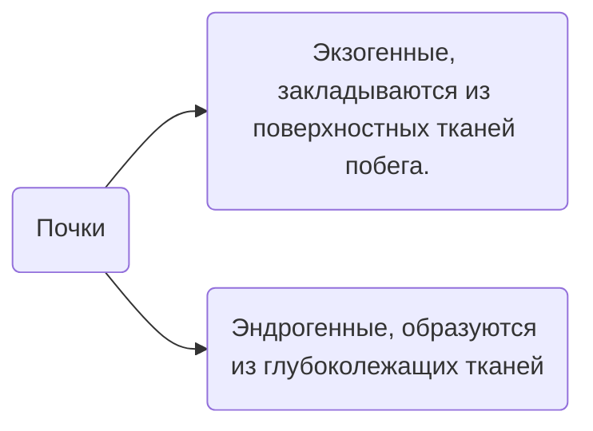
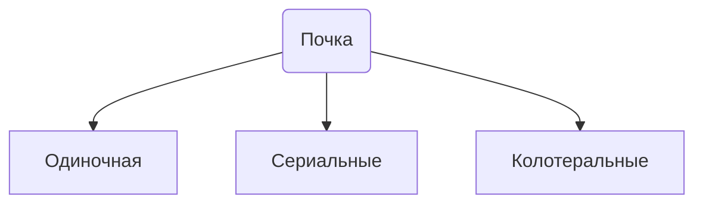
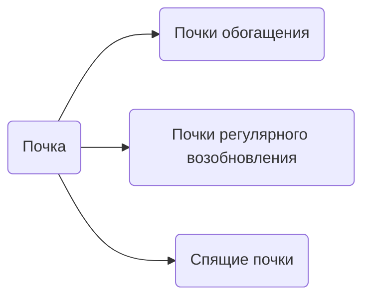
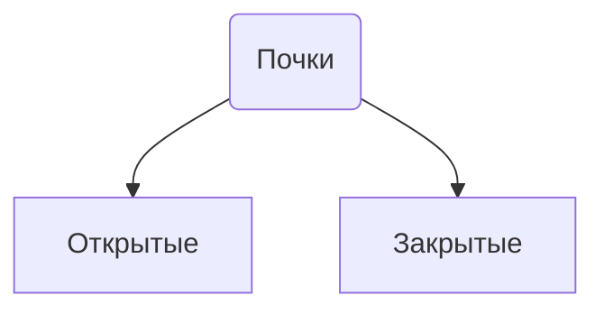
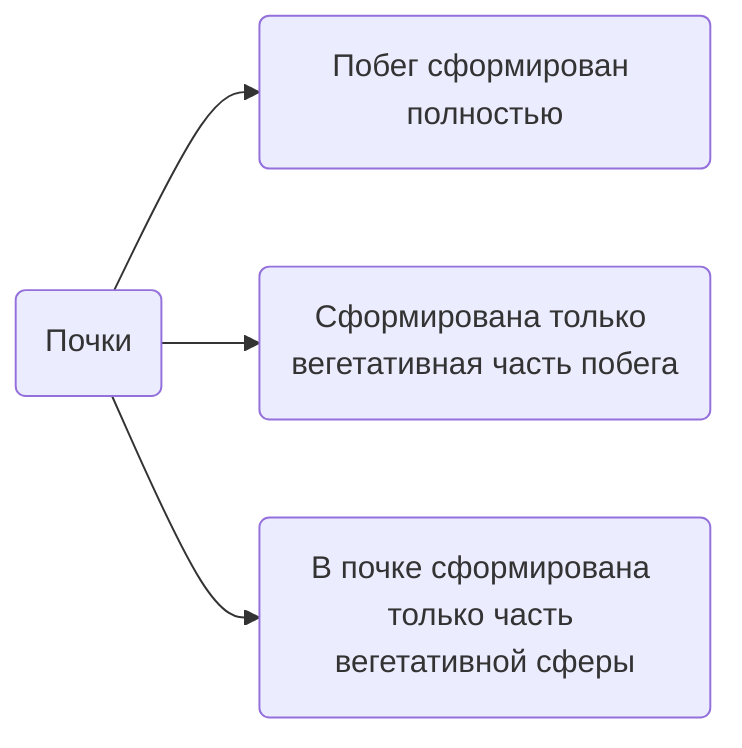

---

---
## Почки
Почка - зачаточный побег

## Классификации
### По расположению

### По внутренней организации

или

### Характер заложения

### По количеству почек в узле

### По времени развертывания почки в побег

![[Почки 2023-10-12 13.13.excalidraw]]
### По защищенности

*Закрытые почки: копытень
Открытые почки: илодея канадская*

### По степени сформированности побегов почки

Побег сформирован полностью - характерно для раннецветущих: копытень, медуница, подснежник, орешник

Сформирована только вегетативная часть побега: липа,

В почке сформирована только часть вегетативной сферы: иванчай, золотая розга, полынь обыкновенная

### Нахождение почек в периоде покоя

## Этапы жизни побега
1. Период формирования побега как зачаточного образования - внутрипочечный или эмбриональный
2. При развертывании почки - внепочечная

## Внепочечная фаза развития
