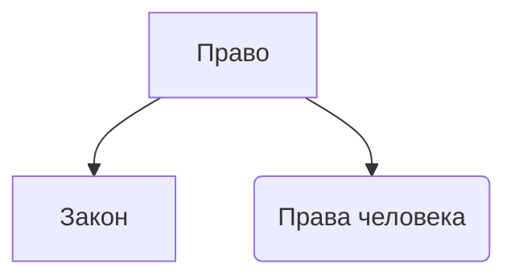

---

---
# Право

**Закон** - приказ государства
## Права человека
Берет свое начало из доктрины естественного права Джон Локка

3 естественных базовых права человека:
- Право на жизнь
- Право на свободу
- Право на собственность

Государство должно издавать законы, защищающие естественные права человека.
В 20 веке естественные права приравниваются к правам человека. Закреплено в международных договорах

