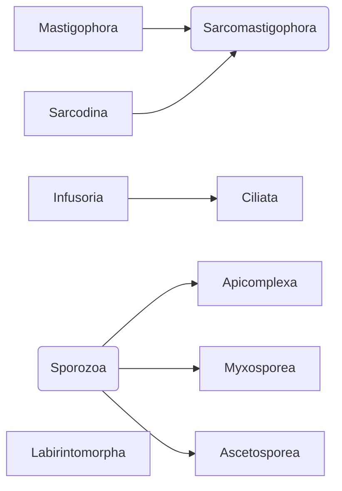

# Развитие изучения протистов

## 1889 Отто Бючли
*Mastigophora
Sarcodina
Infusoria
Sporozoa*

## Открытие методов микроскопии ~1980 Levine
Изменения в систематике:

1. Понимание разницы в строении жгутиков
2. Более подробное изучение органелл
***
Ультраструктурная революция

## Л. Маргулис
Эукариотические клетки возникли в результате поэтапного симбиогенеза (была доказана)
![[Развитие изучения протистов 2023-10-09 09.38.excalidraw.png]]
%%[[Развитие изучения протистов 2023-10-09 09.38.excalidraw.md|🖋 Edit in Excalidraw]], and the [[Развитие изучения протистов 2023-10-09 09.38.excalidraw.dark.png|dark exported image]]%%
Перенос генов из симбионтов в ядро - достаточно частое явление

## Дихотомия
![[Развитие изучения протистов 2023-10-09 09.50.excalidraw.png]]
![[Развитие изучения протистов 2023-10-09 09.50.excalidraw.md|🖋 Edit in Excalidraw]]

### Tetra Mastigota
![[Развитие изучения протистов 2023-10-09 10.19.excalidraw]]
Следствие многожгутиковости:
- появление продольного осевого скелета

