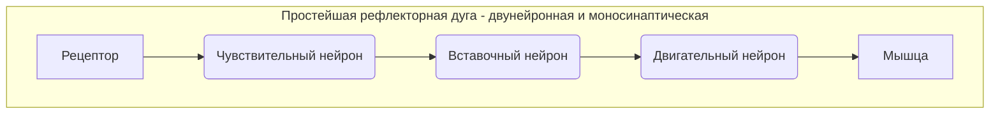

---

---
**Рефлекторная дуга** — это путь, по которому раздражение (сигнал) от рецептора проходит к исполнительному органу

# References:
[Спинной мозг](https://www.youtube.com/watch?v=j1yhtMv6Gn4&t=625s)
[Фоксфорд](https://foxford.ru/wiki/biologiya/reflektornyy-mehanizm-funktsionirovaniya-nervnoy-sistemy)
[Fetching Title#mwi6](https://youtu.be/2m1tRz_eg94)