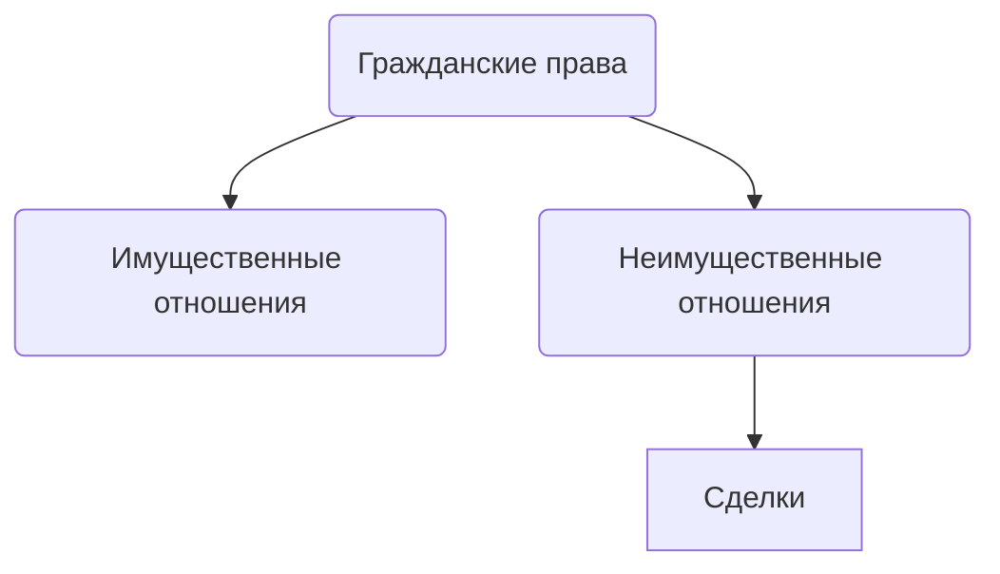

# Сделки
Действия граждан, юридических лиц, направленные на установление изменения, прекращение гражданских прав в отношениях

Воляизъявление=действие .
Договор - это сделка, предполагающая наличие двух и более согласованных волеизъявлений.