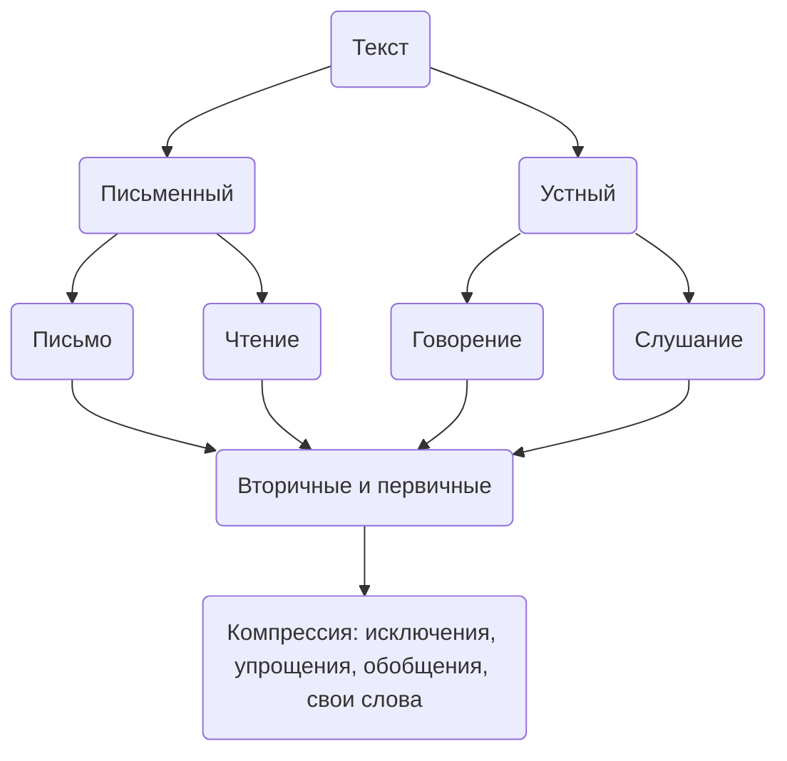

# Стратегии чтения и понимания учебного и научного текстов

## Уровни понимания
1. Репродуктивный (прочитали и пересказали) 
2. Эксплицитный (фактически)
3. Интерпретационный

## Текстовая деятельность (чтение)
| Стратегии      | Приемы                                        |
|----------------|-----------------------------------------------|
| Предтекстовые  | Глоссарий                                     |
| Текстовая      | Составление таблиц, граф.схема, лист вопросов |
| Послетекстовая | Компрессия, Аннотация                                    |

## 
Аргументы (первоисточники)