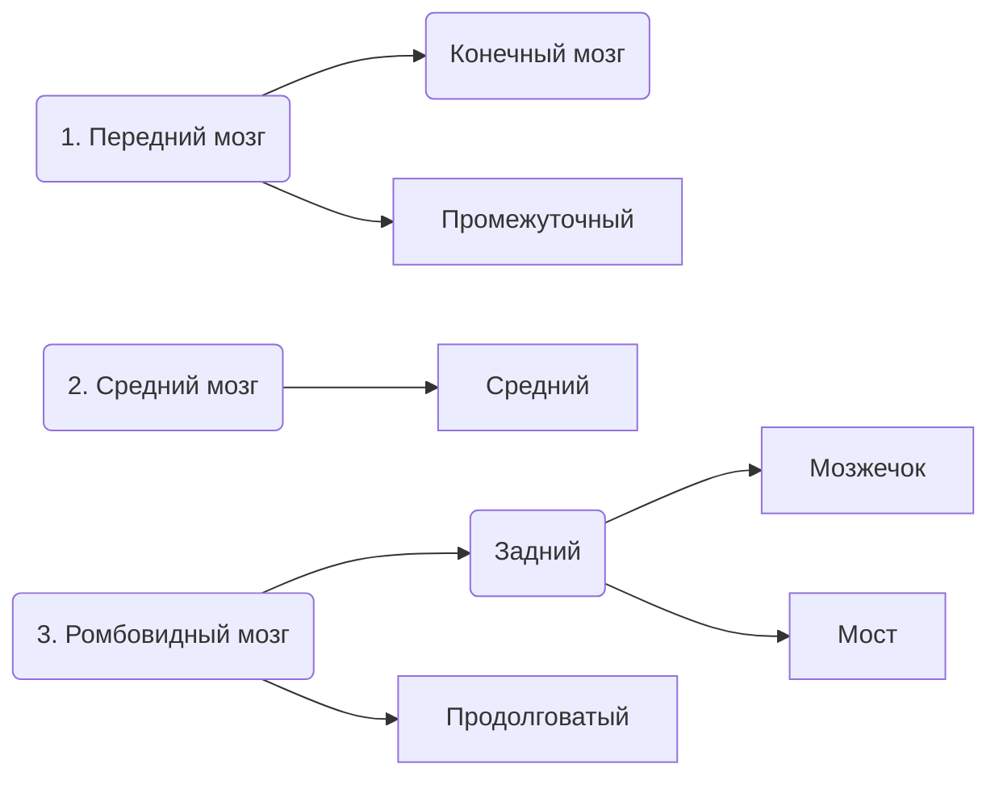

# Строение головного мозга
## Отделы головного мозга

![[../Sources/стрголмоз.jpg]]
[[../Sources/стрголмозподр.png|Подробное строение]]
[[20221108221807.png|Подробное строение 2]]
### Описание
*От низлежащих к вышлежащим отделам мозга*

---
#### Продолговатый мозг с-л-е-з-(а)
- Сосудодвигательный центр (Cосуды)
- Дыхательный центр (Лёгкие)
- Рефлексы пищевого поведения (Еда)
- Защитные рефлексы (рвотный, чихание, кашель) (Защита)
---
#### Мост
- Мимика
- (Тонус мышц)
---
#### Мозжечок
- Отвечает за координацию движения
- Отвечает за равновесие
- Тонус мышц
---
#### Средний мозг
- Ориентировочный рефлекс
- Подкорковые центры зрения и слуха
---
#### Промежуточный мозг
##### 1. Эпифиз
- Вырабатывает гормон сна
##### 2. Таламус
- Центр чувствительности
##### 3.  Гипоталамус (зрительный бугор)
- Высший центр вегетативной нервной системы
- Поддерживает гомеостаз
	- Центр голода и насыщения
	- Центр жажды
	- Центр терморегуляции
---
#### Кора больших полушарий (Полушария конечного мозга)
##### 1. Лобная доля
- Ассоциативная область
- Двигательный центр
- Речевой центр Брока

##### 2. Теменная доля
- Ассоциативная область
- Соматосенсорный центр

##### 3. Височная доля
- Слуховой центр
- Вестибулярный центр
- Речевой центр Вернике
##### 4. Затылочная доля
- Зрительный центр
---
### Иная классификация

# References:
- https://www.youtube.com/watch?v=yo6MwUAWbDs