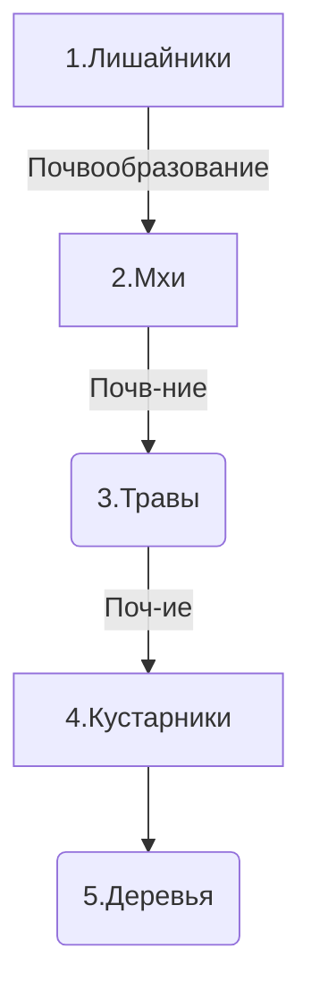
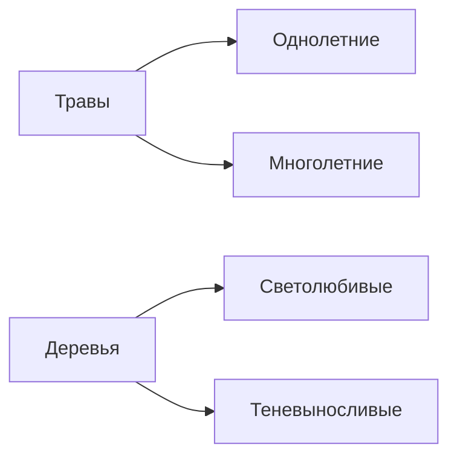

# Сукцессия
## Definition
Последовательная смена природных сообществ
## Этапы

```mermaid
graph TD

	1.Лишайники-->|Почвообразование|2.Мхи-->|Почв-ние|3(3.Травы)
	3-->|Поч-ие|4.Кустарники-->5(5.Деревья)
	
```
## Подробнее

```mermaid
graph LR
	
	Травы-->Однолетние
	Травы-->Многолетние
	
	Деревья-->Светолюбивые
	Деревья-->Теневыносливые
	
```
# References:
- [[]]