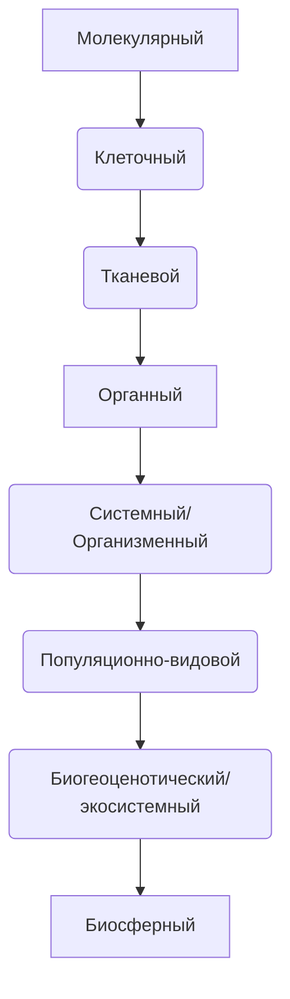

# Main

```mermaid
graph TD;

Молекулярный --> К(Клеточный)
К --> Т(Тканевой)
Т --> Органный --> С(Системный/Организменный)
С --> ПВ(Популяционно-видовой)
ПВ --> БГ(Биогеоценотический/экосистемный)
БГ --> Биосферный
```

# References:
- [Foxford](https://foxford.ru/wiki/biologiya/urovni-strukturnoy-organizatsii-zhivogo)