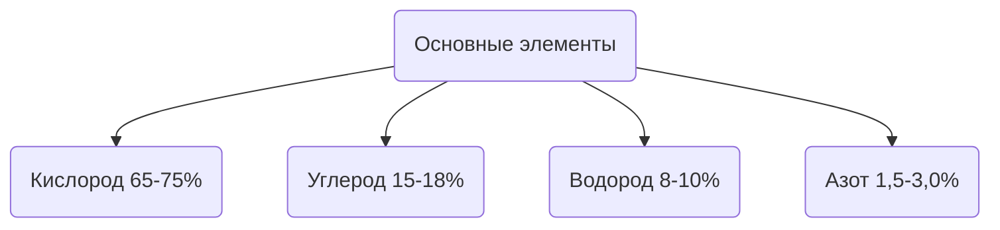

# Химический состав
На долю четырех элементов приходится 98% массы клетки

<table>  
	<tr>  
		<th></th>  
		<th>Макроэлементы</th>  
		<th>Микроэлементы</th>
	</tr>  
	<tr>  
		<th>Количество</th>  
		<td>~1,9%</td>  
		<td>~0.1%</td>  
	</tr>  
	<tr>  
		<th>Элементы</th> 
		<td>Сера, фосфор, хлор, калий, натрий, магний, кальций и железо</td>  
		<td>Цинк, медь, йод, фтор, марганец, селен, кобальт, молибден, стронций, никель, хром, ванадий и др.</td>
	</tr>  
</table>
