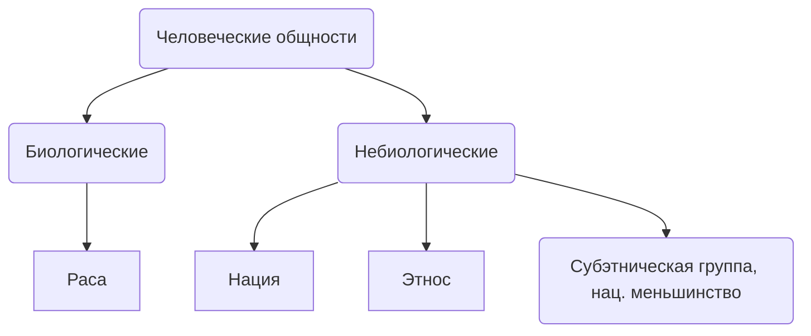

---

---
# Человеческие общности

## Полиэтничность России
Россия - полиэтническая (многонациональная) страна

## Национальные образования
более 25% республик являются национальными образованиями

## Этнический состав
**Этноним** - название народа