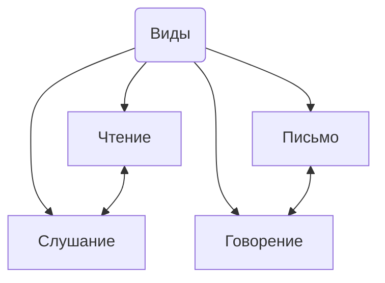
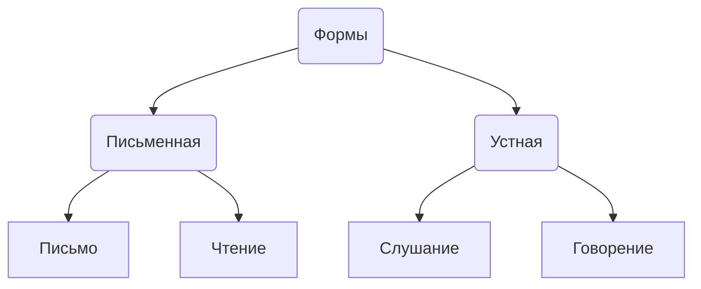

# Чтение как специфический вид речевой деятельности

## Определение
**Чтение** - рецептивный вид деятельности

## Виды речевой деятельности

Говорение и письмо - активные виды речевой деятельности, продуктивные виды
***
Чтение и слушание - активно-пассивные, рецептивные виды речевой деятельности, в основе которого лежит восприятие; 
	Чтение - перевод буквенного кода в звуковой, либо во внутренней, либо во внешней речи
		Функции: 
			- Познавательная (глагол *знать*)
			- Регулятивная (*уметь*)
			- Ценностно-ориентационная (*воспитание*)
			- Реагирование

## Формы речи

| Форма речи | Активные виды речевой деятельности | Активно-пассивные виды речевой деятельности |
|------------|------------------------------------|---------------------------------------------|
| Устная     | Говорение                          | Слушание                                    |
| Письменная | Письмо                             | Чтение                                      |

## Механизмы чтения
1. Механизм эквивалентных замен (перевод)
2. Механизм компрессии (сведение до ключевых смыслов)
3. Механизм антиципации (предвосхищения - прогнозирования)
***
Компрессировать ![[IMG_20230926_112715175.jpg]]
Растение, корень, лист, движение воды
***

## Виды чтения
| Основание классификации | Виды чтения      |
|-------------------------|------------------|
| Скорость                | Быстрая          |
|                         | Медленнная       |
| По технике              | Вслух            |
|                         | Про себя         |
|                         | Слоговое         |
|                         | Скорое           |
| Подготовка              | Подготовленные   |
|                         | Неподготовленные |
| Место                   | Метро            |
|                         | Автобус          |
|                         | Классное         |
|                         | Аудиторное       |
|                         | Домашнее         |
| По цели                 | Изучающее        |
|                         | Просмотровое     |
|                         | Ознакомительное  |
| По задачам              | Смысловое        |
|                         | Функциональное   |
