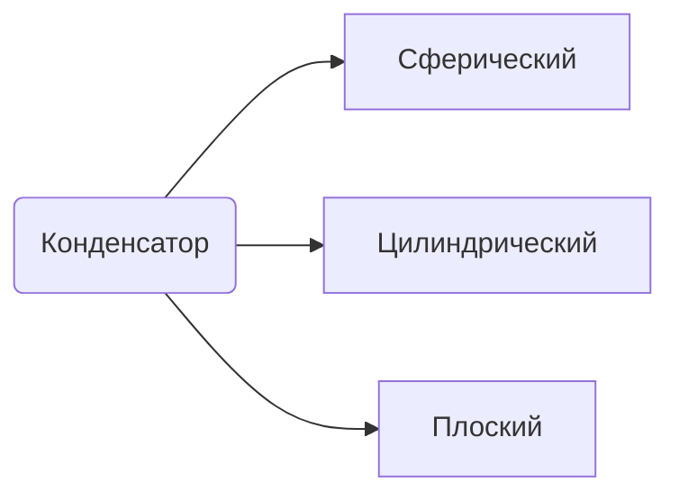

**Электрическая емкость** - способность проводников накапливать электрический заряд
под физической величиной эл.емкости понимают заряд, который необходимо сообщить проводнику для увеличения его потенциала на 1 вольт 
$C = q/ \phi$

Ёмкость уединенного проводника зависит от размеров проводника, формы проводника и диэлектрической проницаемости среды 

взаимная ёмкость двух проводников
$C = q / (\phi_1 - \phi_2)$ 
Взаимная ёмкость - расстояние между проводником и диэлектрическая проницаемость среды между проводниками

## Конденсатор
* Накопление физического заряда
* Использование в качестве развязки 

### Сферический
* Нет краевых эффектов
* 