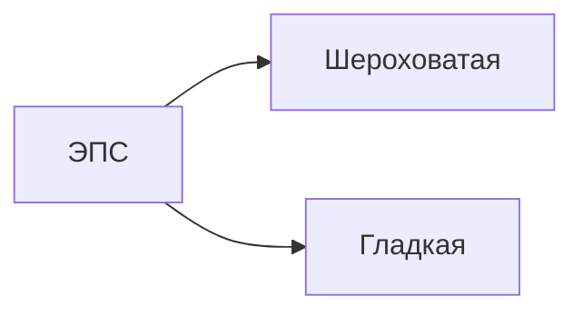

# Эндоплазматическая сеть, комплекс Гольджи и лизосомы

## ЭПС
Система уплощенных цистерн и каналов

### Функции
-  у ЭПС функция транспорта веществ
- Шероховатая - синтез белка
- Гладкая - синтез жиров и углеводов
## Аппарат (комплекс) Гольджи
### Функции
- Транспорт веществ
- Сортировка веществ
- Упаковка в пузырьки (везикулы)
- Модификация веществ
- Образование лизосом