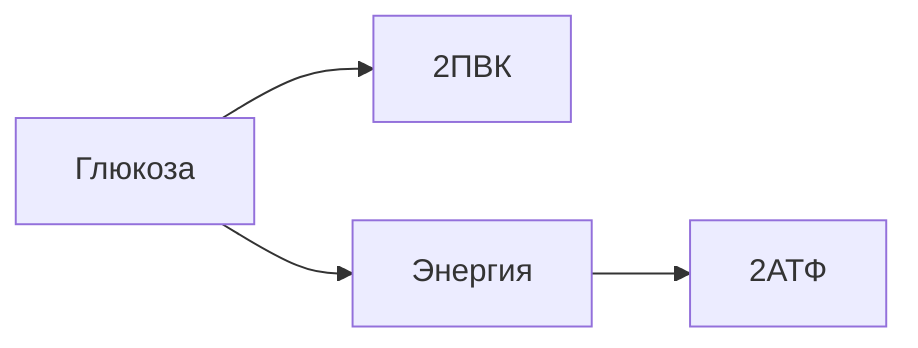
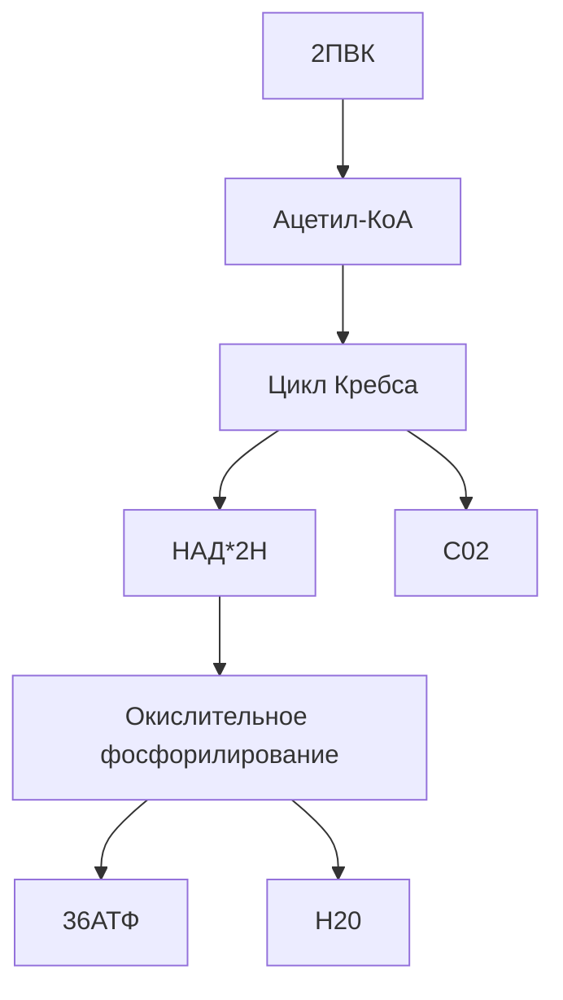
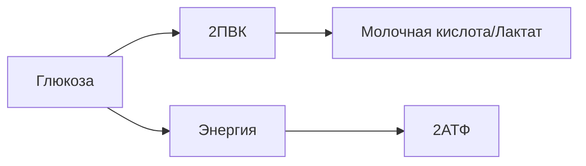
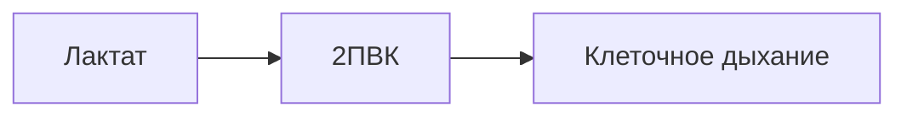
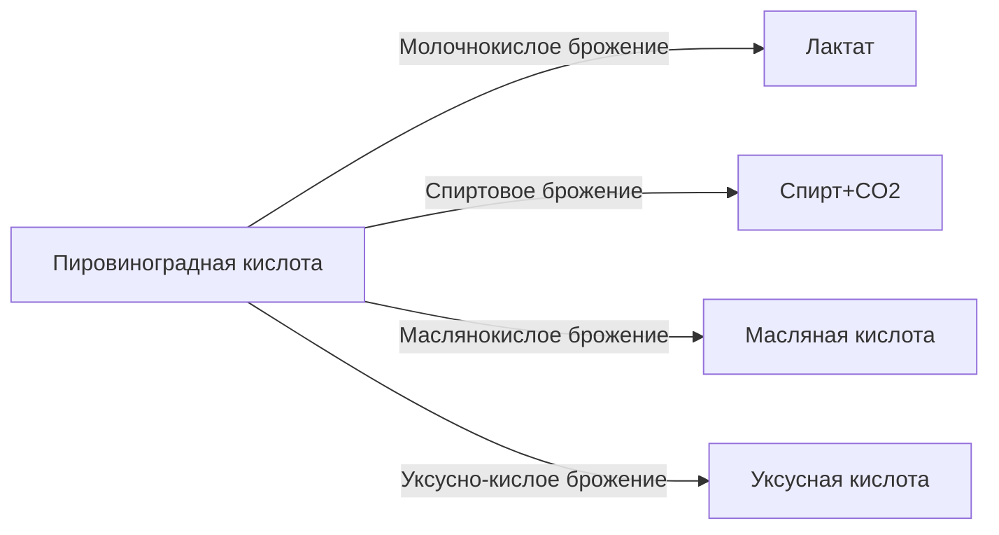

---

---
# Энергетический обмен
## 1. Подготовительный этап
- Проходит в пищеварительной системе
- Выделяется энергия в виде тепла
- У одноклеточных организмов в пищеварительных вакуолях или лизосомах
## 2. Гликолиз
- Расщепление глюкозы без кислорода:

## 3. Клеточное дыхание
- 2ПВК поступает в митохондрии

## Физические нагрузки
В случае физических нагрузок этап клеточного дыхания откладывается

После прекращения физ.нагрузок

## Дополнительно

# References:
- https://www.youtube.com/watch?v=9JDfpMhI46w