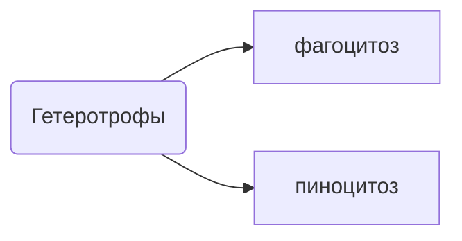

---

---
![[ззоология 2023-09-15 09.13.53.excalidraw.png]]
%%[[ззоология 2023-09-15 09.13.53.excalidraw.md|🖋 Edit in Excalidraw]], and the [[ззоология 2023-09-15 09.13.53.excalidraw.dark.png|dark exported image]]%%

Раковина имеет большой вес, поэтому клетка соприкасается с раковиной посредством изоподий

![[ззоология 2023-09-15 09.26.06.excalidraw.png]]
%%[[ззоология 2023-09-15 09.26.06.excalidraw.md|🖋 Edit in Excalidraw]], and the [[ззоология 2023-09-15 09.26.06.excalidraw.dark.png|dark exported image]]%%

Цитоскелет поддерживает не только органоиды, но и крупные молекулы
- Также он может транспортировать органоиды
![[ззоология 2023-09-15 09.32.35.excalidraw.png]]
%%[[ззоология 2023-09-15 09.32.35.excalidraw.md|🖋 Edit in Excalidraw]], and the [[ззоология 2023-09-15 09.32.35.excalidraw.dark.png|dark exported image]]%%

![[ззоология 2023-09-15 09.40.48.excalidraw.png]]
%%[[ззоология 2023-09-15 09.40.48.excalidraw.md|🖋 Edit in Excalidraw]], and the [[ззоология 2023-09-15 09.40.48.excalidraw.dark.png|dark exported image]]%%

Жгутик - стандартная особенность эукариотной клетки!

